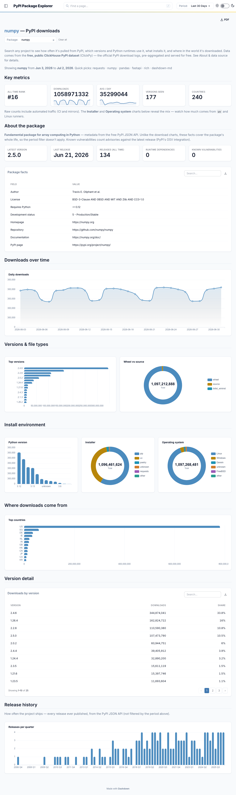

# PyPI Package Explorer

An interactive analytics dashboard for **PyPI download statistics** — search any
package to see how often it's installed, which versions and Python runtimes pull it,
what installs it (`pip`, `uv`, …), and where in the world the downloads come from.

Built with [Dashdown](https://pypi.org/project/dashdown-md/): the whole dashboard is
just Markdown files with embedded SQL — no JavaScript, no frontend build. Data comes
from **[ClickPy](https://clickpy.clickhouse.com)**, the free public ClickHouse mirror
of the official PyPI download logs. **No API key, no account, no billing.**



## Pages

| Page | What it shows |
| --- | --- |
| 🔍 **Explore a package** | Downloads over time, top versions, wheel-vs-source, Python-version / installer / OS mix, top countries, release cadence, and package metadata for any one project. |
| ⚖️ **Compare packages** | Put several packages side by side across the same metrics. |
| ℹ️ **About & data source** | Where the numbers come from and the caveats (automated traffic, the capped date window). |

A project-wide **Period** control (7 / 30 / 90 days, this month) filters the download charts.

## Quick start

You need **Python 3.12+**. The fastest path uses [uv](https://docs.astral.sh/uv/):

```bash
git clone https://github.com/DirendAI/dashdown-pypi-stats.git
cd dashdown-pypi-stats

uv sync                 # install dependencies into .venv from uv.lock
uv run dashdown serve . # start the dev server with live reload
```

Then open **http://127.0.0.1:8000** and search for a package.

<details>
<summary>Prefer plain <code>pip</code> instead of uv?</summary>

```bash
python -m venv .venv && source .venv/bin/activate
pip install 'dashdown-md[clickhouse]'
dashdown serve .
```
</details>

That's it — the repo ships with prebuilt data caches under `data/`, so the popular-package
views work offline out of the box. Searches for packages outside the cache query ClickPy live.

## How the data works

Two connectors are wired up in [`sources.yaml`](sources.yaml):

- **`clickpy`** — the live, public ClickHouse PyPI dataset. Used for any package, any
  custom date range. Rate-limited (the anonymous `play` user allows 300 queries/hour).
- **`main`** — local Parquet caches under [`data/`](data/) for the top ~5,000 packages
  and the standard date presets, so the most common views are instant and spend no
  ClickPy quota.

### Refreshing the caches

The Parquet files are regenerated by [`scripts/build_cache.py`](scripts/build_cache.py):

```bash
uv run python scripts/build_cache.py            # top 5000 packages, ~130 days
uv run python scripts/build_cache.py --top 10000 --days 200
```

A GitHub Actions workflow ([`refresh-cache.yml`](.github/workflows/refresh-cache.yml))
runs this **daily at 03:17 UTC** and commits the refreshed caches automatically. It exits
non-zero on incomplete data, so a bad refresh shows up as a red run rather than a silently
short cache.

## Project layout

```
pages/         Dashboard pages (Markdown + <Component/> tags) — one file per route
queries/       Shared SQL and Python queries referenced by the pages
data/          Prebuilt Parquet caches (the `main` connector)
scripts/       build_cache.py — rebuilds the caches from ClickPy
clickpy.py     Helpers for the live ClickPy connector (windows, breakdowns, daily series)
pypi_api.py    Package metadata from the public PyPI JSON API
assets/        Custom CSS
sources.yaml   Connector definitions (clickpy + main)
dashdown.yaml  Dashboard config (title, theme palette, global date filter)
AGENTS.md      Authoring guide for coding agents (+ .references/ docs)
```

## Handy commands

```bash
uv run dashdown check                 # do the config + every page still render?
uv run dashdown connectors --test     # are the connectors reachable?
uv run dashdown build . --out dist    # static export of the whole dashboard
```

## Notes & caveats

- Raw download counts **include automated traffic** (CI runners and mirrors). The
  Installer and Operating-system charts reveal how much — watch the `uv` and Linux share.
- The date window is deliberately capped at 90 days: an unbounded scan over the raw
  download logs would read hundreds of GiB per query.
- This is a self-hosted dashboard, not a distributable package — dependencies only, no build.

## License & data

Dashboard code lives here; the underlying download data is provided by
[ClickPy](https://clickpy.clickhouse.com) and the [PyPI JSON API](https://docs.pypi.org/api/json/).
Please respect their terms and rate limits.
